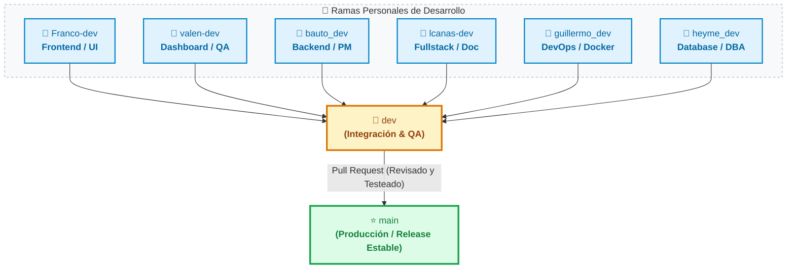

# 🌾 Córdoba Vidriera Productiva — Digitalización y Gestión Integral

Aplicación web integral diseñada para la modernización, automatización y centralización del programa provincial **“Córdoba Vidriera Productiva”**, impulsado por el **Ministerio de Bioagroindustria** en conjunto con el **Ministerio de Producción, Ciencia e Innovación Tecnológica** de la Provincia de Córdoba.

---

## 📌 Descripción del Proyecto

El sistema sustituye los procesos manuales y descentralizados (Google Forms / Sheets) por una plataforma web automatizada de alto rendimiento que administra todo el ciclo de vida de los expositores (PyMEs agroalimentarias y agroindustriales).

### 🚀 Módulos Principales
1. **Autogestión del Productor / Expositor:**
   - Registro de nexo y autenticación de usuarios.
   - Carga dinámica del perfil de la PyME, catálogo de productos, puntos de venta y redes.
   - Repositorio de activos digitales (subida de logotipos editables y galería fotográfica de 1 a 5 imágenes).
   - Aceptación digital obligatoria del *Manual del Expositor 2026*.
   - Sistema ágil de reempadronamiento anual de datos.
2. **Dashboard de Gestión Administrativa (Ministerio):**
   - Panel de control de estados: *Nuevos, Pendientes de Validación, Registrados y Rechazados*.
   - Previsualización y validación humana de documentación y activos.
   - Filtrado avanzado por geolocalización (departamentos) y rubros para organización de ferias.
   - Automatización del envío de correos electrónicos con resoluciones de estado.
   - Exportación de listados de expositores en tiempo real.
3. **Expositor Digital (Consulta Pública y Ciudadana):**
   - Mapa interactivo provincial dividido por departamentos con renderizado rápido.
   - Fichas interactivas de oferta productiva y visualización pública del catálogo regional.

---

## 🛠️ Stack Tecnológico

| Capa | Tecnología | Descripción |
| :--- | :--- | :--- |
| **Frontend** | **React (SPA)** | Arquitectura modular basada en componentes, Virtual DOM y navegación fluida sin recargas. |
| **Backend** | **FastAPI (Python)** | Framework asíncrono de alto rendimiento, comunicación en tiempo real con WebSockets y documentación OpenAPI/Swagger. |
| **Base de Datos** | **Oracle Database** | Motor relacional robusto para garantizar integridad, seguridad y disponibilidad de datos gubernamentales. |
| **DevOps / Despliegue** | **Docker & Docker Compose** | Empaquetado en contenedores y despliegue modular/monolítico adaptado a la infraestructura ministerial. |

---

## 🌿 Flujo y Sistema de Ramas (Git Branching)

### Descripción de Niveles:

1. **Ramas Personales de Desarrollo:**
   - Cada integrante desarrolla sus características y tareas asignadas de manera aislada (`Franco-dev`, `valen-dev`, `bauto_dev`, `lcanas-dev`, `guillermo_dev`, `heyme_dev`).
2. **Rama `dev` (Integración):**
   - Recibe los cambios desde las ramas personales a través de Pull Requests para pruebas conjuntas e integración del sistema.
3. **Rama `main` (Producción / Release):**
   - Contiene únicamente las versiones finales, estables y completamente revisadas listas para entrega.
